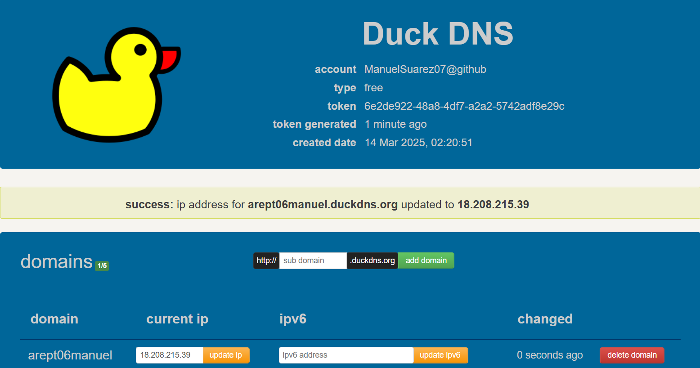
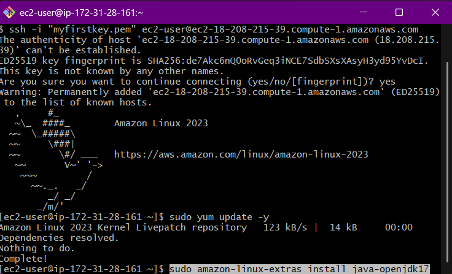
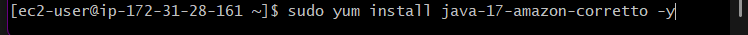
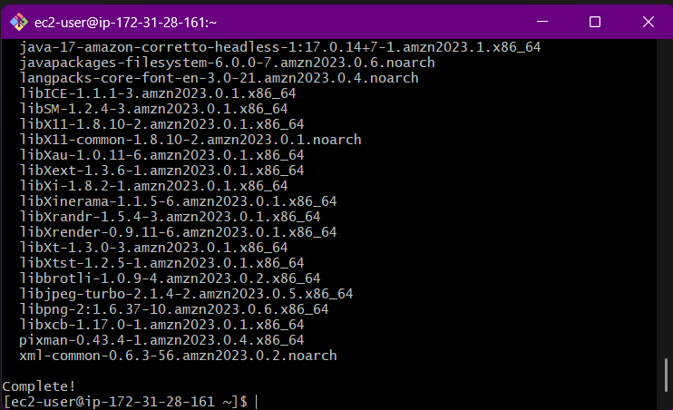
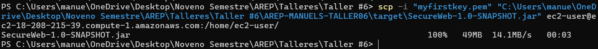
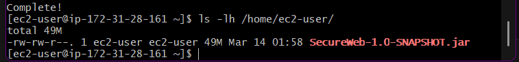
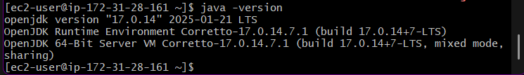
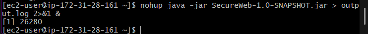
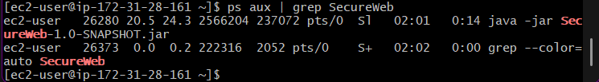

# Enterprise Architecture Workshop: Secure Application Design

In this workshop, we will design and deploy a secure, scalable application using AWS infrastructure with a focus on best practices for security. Our architecture will feature two primary components:

## 🖥️ Server Features

- **Server 1: Apache Server**  
  The Apache server will be responsible for serving an asynchronous HTML+JavaScript client over a secure connection using TLS. Client-side code will be delivered through encrypted channels, ensuring data integrity and confidentiality during download.

- **Server 2: Spring Framework**  
  The Spring server will handle backend services, offering RESTful API endpoints. These services will also be protected using TLS, ensuring secure communication between the client and the backend.

## 🔑 Key Security Features

- **TLS Encryption:** Secure transmission of data using TLS certificates generated through Let’s Encrypt, ensuring confidentiality and integrity.
- **Asynchronous Client:** Our HTML+JavaScript client will leverage async techniques to optimize performance while maintaining secure communication.
- **Login Security:** We will implement login authentication, with passwords securely stored as hashes.
- **AWS Deployment:** All services will be deployed and managed on AWS, leveraging its secure, reliable infrastructure.

This workshop will guide participants through the process of integrating these security measures, configuring multi-server deployments, and utilizing modern encryption techniques to protect user data.


## 📁 Project Structure

```
│──  src
│   ├──  main
│   │   ├──  java
│   │   │   └──  com.eci.secureweb
│   │   │       ├──  config
│   │   │       │   ├── SecurityConfig.java
│   │   │       ├──  controller
│   │   │       │   ├── helloController.java
│   │   │       │   ├── PropertyController.java
│   │   │       │   ├── UserController.java
│   │   │       ├──  data
│   │   │       │   ├── UserData.java
│   │   │       ├──  model
│   │   │       │   ├── Property.java
│   │   │       │   ├── User.java
│   │   │       ├── repository
│   │   │       │   ├── PropertyRepository.java
│   │   │       │   ├── UserRepository.java
│   │   │       ├── service
│   │   │       │   ├── PropertyService.java
│   │   │       │   ├── UserService.java
│   │   │       ├── PasswordEncoder.java
│   │   │       ├── WebSecure.java
│   │   ├──  resources
│   │   │   ├──  keystore
│   │   │   │   ├── keystore.p12
│   │   │   │   ├── server.cer
│   │   │   │   ├── truststore.p12
│   │   │   ├──  static
│   │   │   │   ├── index.html
│   │   │   │   ├── login.html
│   │   │   │   ├── loginscript.js
│   │   │   │   ├── script.js
│   │   │   │   ├── styles.css
│   │   │   ├──  application.properties
│   ├──  test
│   │   ├── java
│   ├──  target
│   ├──  .gitignore
│   ├──  LICENSE
│   ├──  README.md
│   ├──  pom.xml
```

## 🛠 Class Design

#### 📄 **Model:** `Property`
- **Descripción:** Representa una propiedad en la base de datos.
- **Atributos:** `id`, `address`, `price`, `size`, `description`.
- **Anotaciones:** `@Entity`, `@Table`, `@Id`, `@GeneratedValue`, `@NotBlank`, `@NotNull`.

#### 📄 **Model:** `User`
- **Descripción:** Representa un usuario en la base de datos.
- **Atributos:** `id`, `username`, `password`.
- **Anotaciones:** `@Entity`, `@Table`, `@Id`, `@GeneratedValue`.

### 📂 Repository Layer

#### 📄 **Repository:** `PropertyRepository`
- **Descripción:** Interfaz para acceder a los datos de propiedades.
- **Extiende:** `JpaRepository<Property, Long>`.
- **Métodos personalizados:** `findByFilters` para búsquedas con filtros.

#### 📄 **Repository:** `UserRepository`
- **Descripción:** Interfaz para acceder a los datos de usuarios.
- **Extiende:** `JpaRepository<User, Long>`.
- **Métodos personalizados:** `findByUsername`.


### 🧠 Service Layer

#### 📄 **Service:** `PropertyService`
- **Descripción:** Contiene la lógica de negocio para propiedades.
- **Métodos principales:**
  - `getAllProperties`
  - `searchProperties`
  - `getPropertyById`
  - `saveProperty`
  - `updateProperty`
  - `deleteProperty`

#### 📄 **Service:** `UserService`
- **Descripción:** Contiene la lógica de negocio para usuarios.
- **Implementa:** `UserDetailsService`.
- **Métodos principales:**
  - `createUser`
  - `authenticate`
  - `loadUserByUsername`


### 🌐 Controller Layer

#### 📄 **Controller:** `PropertyController`
- **Descripción:** Expone endpoints RESTful para propiedades.
- **Endpoints principales:**
  - `GET /api/properties`: Obtiene todas las propiedades.
  - `GET /api/properties/search`: Busca propiedades con filtros.
  - `GET /api/properties/{id}`: Obtiene una propiedad por ID.
  - `POST /api/properties`: Crea una nueva propiedad.
  - `PUT /api/properties/{id}`: Actualiza una propiedad existente.
  - `DELETE /api/properties/{id}`: Elimina una propiedad.

#### 📄 **Controller:** `UserController`
- **Descripción:** Expone endpoints RESTful para autenticación y registro de usuarios.
- **Endpoints principales:**
  - `POST /api/auth/login`: Autentica a un usuario.
  - `POST /api/auth/register`: Registra un nuevo usuario.


### 🔐 Security Configuration

#### 📄 **Config:** `SecurityConfig`
- **Descripción:** Configura la seguridad de la aplicación.
- **Anotaciones:** `@Configuration`, `@EnableWebSecurity`.
- **Métodos principales:**
  - `securityFilterChain`: Define las reglas de seguridad y deshabilita CSRF.
  - `corsConfigurationSource`: Configura CORS.
  - `passwordEncoder`: Define el codificador de contraseñas (`BCrypt`).


### 🚀 Main Class

#### 📄 **Main Class:** `WebSecure`
- **Descripción:** Clase principal de la aplicación Spring Boot.
- **Anotaciones:** `@SpringBootApplication`.
- **Método principal:** `main`, que inicia la aplicación y genera un hash de contraseña temporal.


### 🛠 Utility

#### 📄 **Utility:** `PasswordEncoder`
- **Descripción:** Clase de utilidad para generar hashes de contraseñas.
- **Método principal:** `main`, que genera un hash `BCrypt` para una contraseña dada.


### 📝 Data Transfer Object (DTO)

#### 📄 **DTO:** `UserData`
- **Descripción:** Representa los datos de usuario para autenticación y registro.
- **Atributos:** `username`, `password`.

---

## 🏛 System Architecture

1. 🧑‍💻 Architecture: MVC (Model-View-Controller)
2. 🚀 Framework: Spring Boot
3. 🗃️ Database: MySQL
4. 🐋 Containerization: Docker
5. ☁️ Cloud Deployment: AWS
6. 🔄 CI/CD: GitHub Actions
7. 📝 API Documentation: Swagger

## 🖥️ Repository Setup and Execution

### 📂 1. Clone the repository

```bash
git clone https://github.com/ManuelSuarez07/AREP-MANUELS-TALLER06.git
```

### 💻 2. Navigate into the project directory

```bash
cd AREP-MANUELS-TALLER06-main
```

### 🧹 3. Clean and install dependencies

```bash
mvn clean install
```

### 📦 4. Package the application

```bash
mvn clean package
```

### 🚀 5. Run the application

```bash
mvn spring-boot:run
```
> [!IMPORTANT] 
> En el archivo `application.properties`, la base de datos está configurada para conectarse a la instancia de AWS creada. Esta configuración se debe actualizar cada vez que el servidor se inicia.  
> El proyecto **no se ejecutará de manera local** a menos que se reemplace la configuración de la base de datos cambiando la línea correspondiente por `localhost:3306` y usando una base de datos local adecuada.

---
# 🚀 Application Deployment on AWS with Docker

This document describes the steps needed to deploy the application using Docker and AWS.

## 📝 Prerequisites

- 🌐 AWS account
- 🖥️ Configured EC2 instances
- 🐋 Docker and Docker Compose installed
- 🗂️ Docker images uploaded to Docker Hub (`manuelsuarez07/mysql-property-db`)

---

## 🖱️ 1. Connect to the EC2 Instance

```bash
# SSH connection to the instance
ssh -i "your-key.pem" ec2-user@your-ip-address
```

---

## ⚙️ 2. Docker Configuration

### 🐧 2.1 Install Docker (if not already installed)

```bash
sudo yum update -y
sudo yum install docker -y
sudo service docker start
sudo usermod -aG docker ec2-user
```

### 🔍 2.2 Verify installation

```bash
docker --version
```

---

## 🔐 3. Login to Docker Hub

```bash
docker login -u "manuelsuarez07"
```

---

## 📥 4. Pull Docker Images

```bash
# Pull database image
docker pull manuelsuarez07/mysql-property-db
```

---

## 🏗️ 5. Deploy Containers

### 🌐 5.1 Create Docker network

```bash
docker network create property-network
```

### 🗃️ 5.2 Deploy Database

```bash
docker run -d --name mysql-db --network property-network -e MYSQL_ROOT_PASSWORD=your_password -e MYSQL_DATABASE=property-db manuelsuarez07/mysql-property-db
```

### 🖥️ 5.3 Deploy Backend

```bash
scp -i "ruta/a/tu/llave.pem" "ruta/a/tu/archivo.jar" usuario@direccion-de-tu-instancia:/ruta/de/destino/
```

---

## ✅ 6. Verify Deployment

### 🐤 Duck DNS Images



### 🌐 AWS Deployment Images

|  |  |  |  |
|-------------------------------|-------------------------------|-------------------------------|-------------------------------|
|  |  |  |  |

---

### 🎥 Deployment Videos

1. [](https://youtu.be/VkCpB_Xl6KM)


---

## 🛠️ 8. Troubleshooting

### 🛑 Database Connection Error

- 🕸️ Ensure that the containers are on the same Docker network.
- ⚙️ Check the environment variables for the database configuration.

### 🌐 AWS Access Issue from Your PC

- 🔒 Verify the security group rules of your EC2 instance.
- 💻 Try accessing from another machine to rule out local issues.

---

🚀 **LAB06 SUCCESSFULLY COMPLETE!** 🎉


## 👤 Author

* **ManuelSuarez07**

## 🧰 Technologies Used

- Java, HTML, JavaScript, CSS
- Maven
- AWS
- Spring Boot
- MySQL
- Docker
- Swagger
- GitHub Actions
